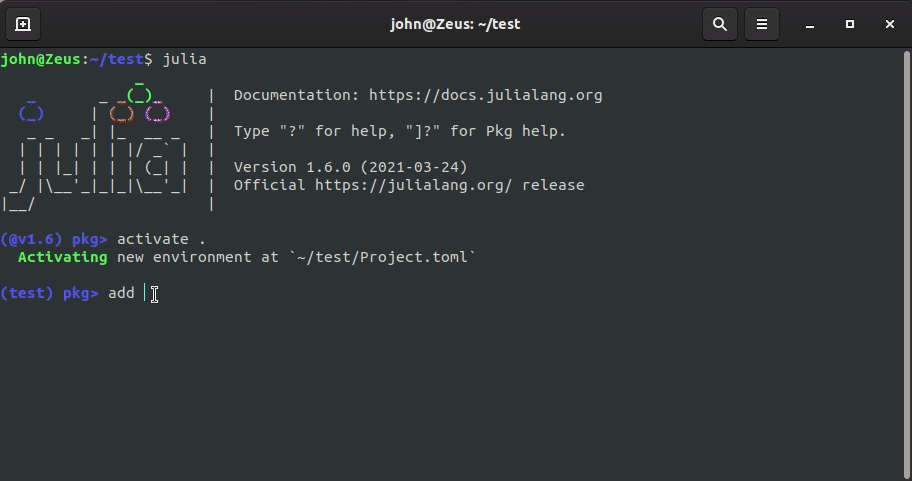
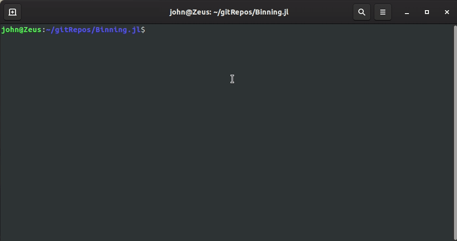
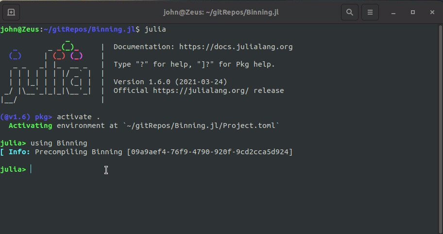
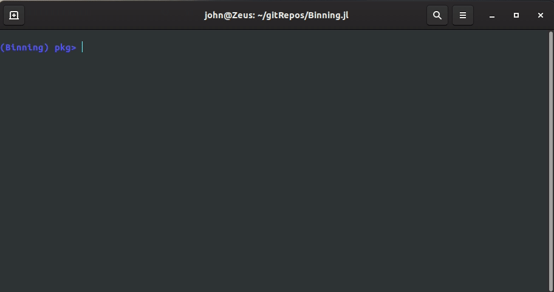
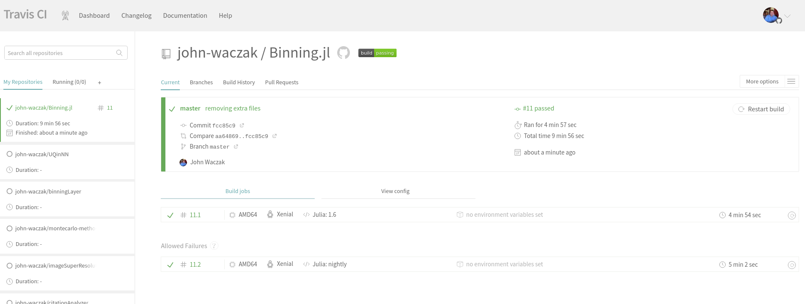
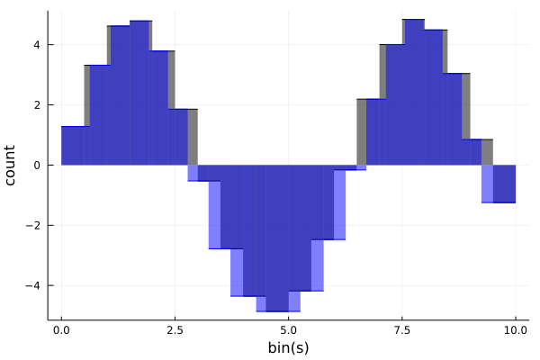
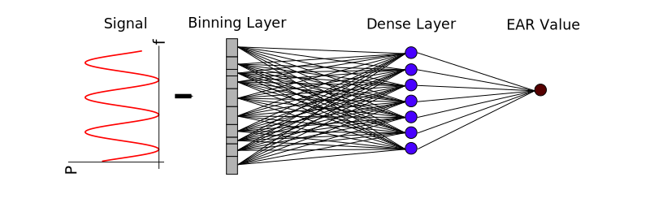
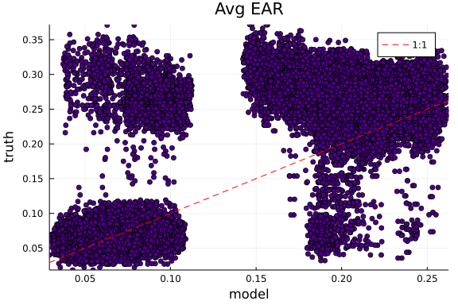
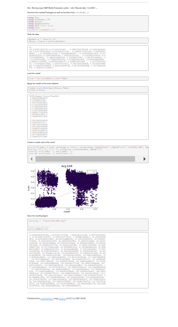

To generate a presentation from these slides, run: 

`jupyter nbconvert PRC-presentation.ipynb --to slides --post serve SlidesExporter.reveal_theme=serif SlidesExporter.reveal_scroll=True SlidesExporter.reveal_transition=none`  

# PRC: Implementing a Novel Machine Learning Method in Julia
## John Waczak 
## May 4 2021

# Outline 
1. Problem Description 
2. Implementation Details 
3. Model Application
4. Next Steps
5. What Worked and What Didn't 
6. Lessons Learned 
7. Topics Suggestions

# 1. Problem Description

- **Abstract Problem**: Machine learning, particularly deep neural networks, tend to be black box solutions. It's hard to understand what exactly is happening to your data. 
- **Specific Research Problem**: Using frequency decomposition of 64 electrode EEG measurements to predict blinking, specifically, eye aspect ratio (EAR) 
- **Solution**: Develop a new neural network layer based on a simple binning procedure

Partition the domain of your function into $N$ bins with $N+1$ bin edges. Model a bin by a smooth step function: 
\begin{equation}
    B(x) = \frac{1}{2}\left(\tanh(\alpha(x-b_l))-\tanh(\alpha(x-b_r)) \right)
\end{equation} 
where $\alpha$ controlls the steepness (a hyperparameter) and $b_l$ and $b_r$ are the left and right bin bin edges, respectively. 

Action of the layer is as follows: 

    

# 2. Implementation Details

**Language of choice:** `Julia`  
**Why?** The neural network library in Julia, `Flux.jl`, is implemented **100%** in Julia: 

Popular libraries like tensorflow are built on top of lower level C++ implementations. This makes it harder to implement new models. 

## Summary: 
- Binning layer implemented in Julia by extending `Flux.jl` 
- Code version controlled via `github` and `gitlab`
- Package envrionment managed via Julia, i.e. we version control the `Project.toml` and `Manifest.toml` files. This is similar to the Conda environments we talked about in class. 
- Code organized into standard package structure via templates from `PkgTemplates.jl` 
- Added fancy docstrings to allow for `help` lookup at the REPL 
- Began writing tests that are stored in `/tests/`
- CI/CD implemented via Travis.ci by adding a simple `.travis.yaml` file 

## Easy package install from github 

## Environment Management

## Help from fancy dosctrings 

## Running Tests 

## CI/CD via Travis

# 3. Model Application 

**Demo Problem**: bin optimization for maintaining integral.  
- Sample sine wave from $x=0$ to $x=10$ with $1000$ points 
- Use `DomainBinner` to bin the 1000 points down to 20 
- Optimize bin edges to maintain the value of the integral

**Problem 2**: Predicting Eye Aspect Ratio (EAR) value from binned EEG frequency data.  

**Model**: Binning layer to reduce 257 frequencies down to 100. Output of binning layer connected to a dense layer with 100 nodes. The dense nodes are then connected to estimate the Ear value

### Results so far
- The `DomainBinner` is able to function together with the `Dense` layer *out of the box* via the `Chain()` function
- `Flux` is able to track the gradients as expected and update the bin edges 
- A single electrode is insufficient to predict the EAR value (as expected) 

Output of evaluation scripts are captured and converted into nice human readable html/markdown documents using `Weave.jl`. 

# 4. Next Steps
- Create slurm scritps to train models on Europa 
- Train more reliable models by utilizing multiple electrodes simultaneously  
- Perform a hyperparamter optimization (number of bins, number of nodes in hidden layer, etc...) 
- Apply binning layer to frequency dimension of Hyper-Spectral Images 
- Explore using tensorboard for live tracking of model convergence 
- Optimize the code for performance (I think Julia is actually column-major, unlike Python so I should probably transpose my data for faster training...) 
- If this actually proves usefull, submit a PR and add the layer to the `Flux` ecosystem. 

# 5. How did you start? What worked? What didn't work? 
- Started development of layer via notebooks 
- The documentation for `Flux.jl` was super helpful for making a new layer that works with the package
- Had issues early on trying to get the auto-diff to work on batches of data. 
- Had trouble coming up with a simple toy problem to test the model on. Eventually was able to settle on the integraal test. 

# 6. Lessons Learned 
The two big takeaways for me were: 
- I'm finally starting to appreciate the value of writing tests for everything. This was super helpful when I was trying to get the auto-diff to work on batches of data. It also helped me catch when I made code-breaking changes (specifically array shape related issues). 
- Using new environments for new projects. This was super helpful for verifying that the code works across multiple machines. 

# 7. Topic Suggestions 
- The version control tutorials were super helpful. It would be nice to add some additional content for the proper way to contribute to larger codes you don't own. Maybe you could add forking and submitting pull requests to the git homework assignment. 
- I would personally be interested in a lecture on containers. I've had plenty of issues trying to work across multiple operating systems and I think this could help. 
